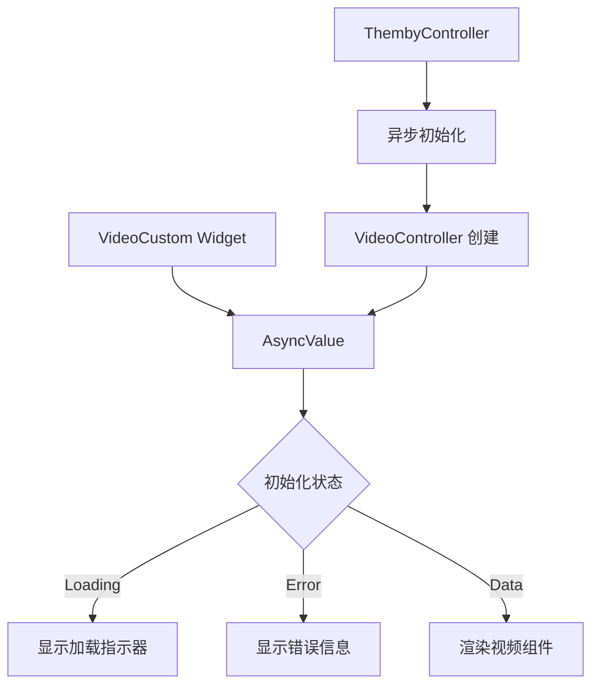

# 视频控制器初始化修复设计文档

## 概述

本设计文档描述了如何修复 `LateInitializationError: Field 'videoController' has not been initialized` 错误。主要问题是异步初始化和同步访问之间的时序问题。

## 架构

### 当前问题分析

1. **时序问题**：`ThembyController.init()` 是异步方法，但 `videoControllerProvider` 立即尝试访问 `late` 字段
2. **生命周期管理**：初始化和组件渲染没有正确同步
3. **错误处理**：缺少对初始化失败的处理

### 解决方案架构



## 组件和接口

### 1. 修改 ThembyController

- 将 `videoController` 从 `late` 字段改为可空字段
- 添加初始化状态管理
- 提供异步获取控制器的方法

### 2. 更新 Provider 架构

- 使用 `AsyncNotifierProvider` 替代同步 Provider
- 处理加载、错误和数据状态
- 确保线程安全

### 3. 修改 VideoCustom Widget

- 使用 `AsyncValue` 处理不同状态
- 添加加载和错误 UI
- 确保正确的生命周期管理

## 数据模型

### VideoControllerState

```dart
sealed class VideoControllerState {}

class VideoControllerLoading extends VideoControllerState {}

class VideoControllerError extends VideoControllerState {
  final String message;
  VideoControllerError(this.message);
}

class VideoControllerReady extends VideoControllerState {
  final VideoController controller;
  VideoControllerReady(this.controller);
}
```

## 错误处理

### 初始化错误

1. **网络错误**：显示重试按钮
2. **权限错误**：显示权限请求提示
3. **设备不支持**：显示友好的错误信息

### 运行时错误

1. **播放错误**：自动重试或显示错误信息
2. **内存不足**：降低视频质量或显示警告
3. **网络中断**：暂停播放并显示网络状态

## 测试策略

### 单元测试

1. **ThembyController 初始化测试**
   - 测试正常初始化流程
   - 测试初始化失败场景
   - 测试重复初始化处理

2. **Provider 状态测试**
   - 测试状态转换
   - 测试错误处理
   - 测试内存管理

### 集成测试

1. **视频播放流程测试**
   - 测试完整的播放流程
   - 测试错误恢复
   - 测试生命周期管理

2. **用户界面测试**
   - 测试加载状态显示
   - 测试错误状态显示
   - 测试用户交互

### 性能测试

1. **初始化性能**：确保初始化时间在可接受范围内
2. **内存使用**：监控内存泄漏
3. **并发访问**：测试多个组件同时访问的情况

## 实现细节

### 关键修改点

1. **ThembyController.dart**
   - 移除 `late` 关键字
   - 添加异步初始化方法
   - 添加状态管理

2. **Provider 定义**
   - 使用 `AsyncNotifierProvider`
   - 处理异步状态
   - 添加错误处理

3. **VideoCustom Widget**
   - 使用 `AsyncValue.when()`
   - 添加加载和错误 UI
   - 优化生命周期管理

### 向后兼容性

- 保持现有 API 接口不变
- 渐进式迁移策略
- 保留现有功能